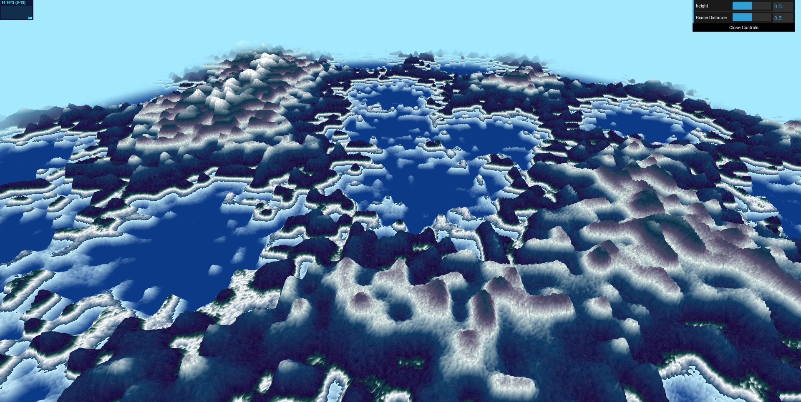
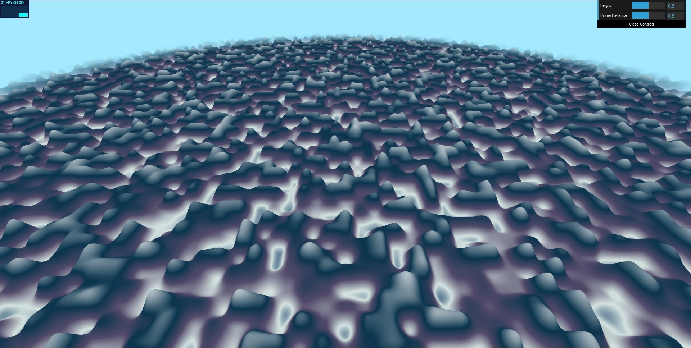
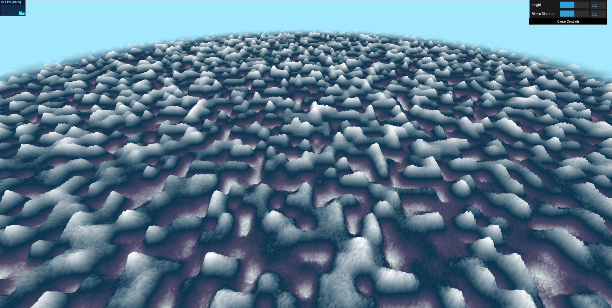

# CIS 566 Homework 1: Noisy Terrain
Jason Wang (jasonwa)

Demo: https://jwang5675.github.io/hw01-noisy-terrain/

References: 
  - Biome Motivation: https://www.gnome-look.org/p/1154368/ 
  - http://thebookofshaders.com/10/
  - http://thebookofshaders.com/11/
  - http://thebookofshaders.com/12/
  - http://thebookofshaders.com/13/

## Noise Functions
There are 4 variations of noise functions used in this procedural terrain. 

- Fractal Brownian Motion: This noise is used to create the mountains of the scene with a smooth heightfield.

- Exponential Noise Redistribution: This noise is used to add edges and small peaks within the mountains with a heightfield. This adds details to the mountains to prevent it from looking like smooth lumps. 

- Perlin Noise: This noise is used to add terrain attributes to the scene. Specifically, the noise is used to add coloring details within the fragment shader to the snowy mountain and forest regions. The color of the mountains is defined by a height field interpolated between different moisture layers. Perlin noise is then added to the mountain as color to give the mountains an effect of snowy cliff rocks and trees within forest and snowy peak regions. The Perlin noise is average with the pixels around it and smoothed with linear interpolation between the Perlin noise and the original moisture color of the biome.

- Worley Noise: This noise is used to make the biomes of the scene. Worley noise is used to increase the height threshold such that things near the center of the Worley Noise within a grid are made into larger mountain peaks while the areas away from the centers are made into lakes.

## GUI Elements
There are two added GUI Elements.

- Height: This increases the height field of the environment. Increasing the height creates more mountain regions and decreases the amount of water biome regions. Decreasing the height field does the opposite: it creates fewer high mountains and adds more water biome regions.

- Biome Distance: This increases the size of each biome. As the biome distance increases/decreases, this increases/decreases the size of the grid used by Worley noise in determining biomes. Thus, it increases/decreases the distances between mountain and water biome regions.
